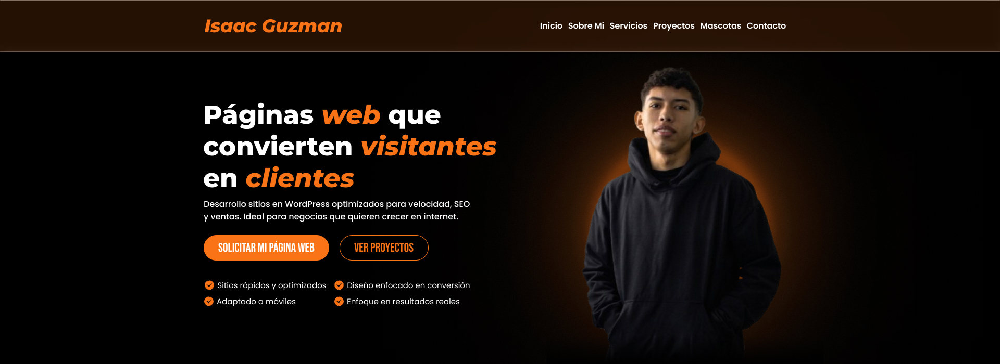

# Portafolio Web - Isaac Guzman



Portafolio web personal enfocado en mostrar proyectos, habilidades y servicios de desarrollo web con un diseño moderno y orientado a resultados.

---

## 🚀 Sobre el proyecto

Este portafolio fue desarrollado con el objetivo de:

- Mostrar mis proyectos de forma clara y atractiva  
- Presentar mis servicios como desarrollador web  
- Generar oportunidades laborales y clientes  

---
## 🛠 Tech Stack & Tools
<p align="left">
  <a href="https://skillicons.dev" target="_blank">
    
  </a>
</p>

---

## 📁 Estructura del proyecto
```
portfolio-web/
├── index.html
├── public/
│   ├── icons/
│   └── images/
├── src/
│   ├── js/
│   │   └── script.js
│   ├── css/
│   │   ├── button.css
│   │   ├── footer.css
│   │   ├── form.css
│   │   ├── header.css
│   │   ├── index.css
│   │   ├── index.min.css
│   │   ├── mascotas.css
│   │   ├── mascotas.min.css
│   │   ├── proyectos.css
│   │   ├── proyectos.min.css
│   │   ├── responsive.css
│   │   └── responsive.min.css
│   └── views/
│       ├── mascotas.html
│       └── proyectos.html
└── README.md
```
---

## 🌐 Demo

**[Ver portafolio](https://isaac-g17.github.io)**.

---

## 👨‍💻 Autor

Este proyecto fue creado por **[Isaac Guzmán Mora](https://github.com/Isaac-G17)**.
